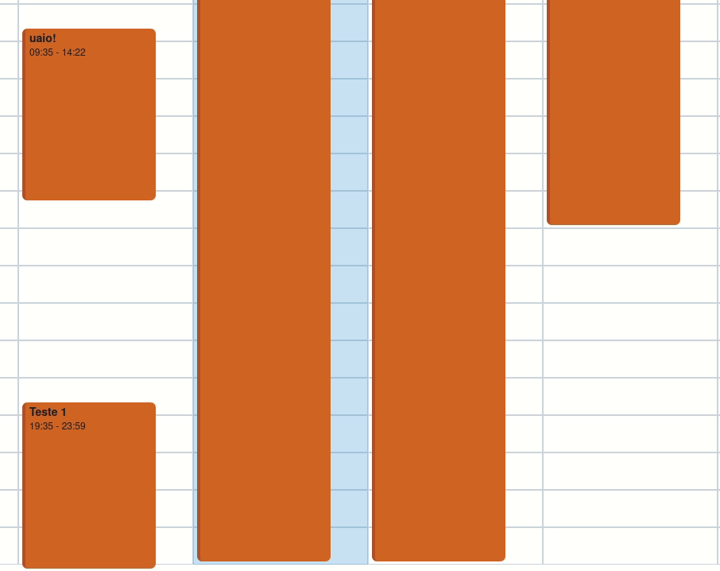

# calendar
\
This is a Google Calendar clone I developed in 1 week. Because of the limited time, functionality was prioritized over design (which is not great, despite the charismatic word art logo).

## Summary
  1.  [Stack](#stack)
  2.  [Screens](#screens)
  3.  [Features](#features)
  5.  [TODO](#todo)

## Stack
For this project, I used the MERN Stack - MongoDB, Express.js, React.js and Node.js.

### Client-side
The front-end tools I used are:
  * [React.js](https://reactjs.org/)
  * [Chakra UI](https://chakra-ui.com/)
  * [React Router](https://reactrouter.com/)
  * [React Icons](https://react-icons.github.io/react-icons/)
  * [React Async](https://github.com/async-library/react-async)
  * [jQuery](https://jquery.com/) (barely)
  * [Axios](https://github.com/axios/axios)

### Server-side
The back-end tools I used are:
  * [MongoDB](https://www.mongodb.com/), [Mongo Atlas](https://www.mongodb.com/cloud/atlas)
  * [Express.js](https://expressjs.com/)
  * [Node.js](https://nodejs.org/en/)
  * [mongoose.js](https://mongoosejs.com/)
  * [bcrypt.js](https://github.com/kelektiv/node.bcrypt.js)
  * [node-jsonwebtoken](https://github.com/auth0/node-jsonwebtoken)
  * [cors](https://github.com/expressjs/cors)

I tried using [Passport.js](http://www.passportjs.org/), but couldn't figure out how to use Google OAuth 2.0 with the client-side rendering of a React app.

## Screens
This app consists in three possible screens: login, signup and the proper calendar. The initial page is the login screen, for you must logged to access your own calendar.

### Login
The login page is simply where users can sign in to their account - and if they do not have an account, they can press the signup button.

### Signup
The signup page is simply where users can create their accounts. The password is validated by regex and must contain at least 8 characters (minimum 1 number, 1 lowercase letter, 1 uppercase letter).

### Calendar
This is the main window, where the user can view, create, edit and delete events. The calendar is presented in a week-view with the today column highlighted - pretty similar to Google Calendar's own - and the events are marked in it in orange items, containing their titles and times. There are two `arrow` buttons that navigate to the last and next week, updating the dates and the events shown, as well as a `Today` button, that takes the user back to the current week.

At the lower right, theres a `+` button, that'll open the `new event` modal dialog.

By clicking any event card, the user is able open another modal dialog in which they can see the event's current details, as well as edit them and delete the event. For lack of time, both feature (seeing and editing the event's details) were merged into one modal dialog (see [TODO](#todo)).

## Features
### Multiple-day events
The app support multiple day events (no limitation), although it glitches when an event lasts through multiple weeks.

### Non-overlapping events
The app won't let you create an event that has a time conflict with an existing one, raising a warning. It's also impossible to edit an event to create an overlap.

### Client-side rendering
The app was fully developed in React.js as a single-page app (SPA) with client-side rendering. The server was used only to fetch user and event's data - not HTML.

### REST API
The server and it's endpoints were developed in Node.js and in the format of a RESTful API in which the requests' authentication is made by a JWT that is store in the client-side (`localStorage`) and sent to the server-side through the Authorization header (`Bearer token` format).

### Events linked to their creator
All events are linked to their creator by id (see [back-end/models/schemas/events.js](https://github.com/lucasvianav/calendar/blob/main/back-end/models/schemas/event.js)).

### Mobile-friendly
The app is responsive and mobile-friendly, although not completely optmized. 

### CRUD Events
It's possible to Create, Read, Update and Delete events and their details.

### Multiple users
Any number of users can create their accounts and events. There was no time to implement the full user CRUD, so it's only possible to Create and Read users and their info.

### Guests and RSVP
The server endpoints for guest inviting and RSVPing are implemented and working, but unfortunately I had no time to add the funcionality to the front-end and integrate it with email invites.

## TODO
  * Improve the site's design
  * Solve the visual bug (front-end) caused by cross-week events
  * Improve responsiveness (make more mobile-friendly)
  * Polish the header/navbar (make it visually appealing)
  * Add `guests` and `RSVP` support to front-end (back-end is working)
  * Create an `event overview` modal box with general information (including description) - it would be opened when clicking in an event and it would have the  `edit event` button
  * Implement email reminder for events
  * Fix text wrap glitches (event's title and time in the calendar item)
  * Polish login/signup forms' sizes and position
  * Add a dark theme
  * Add the `UD` to user's CRUD
